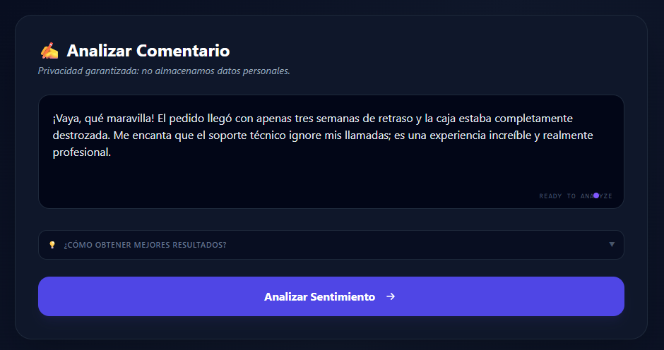
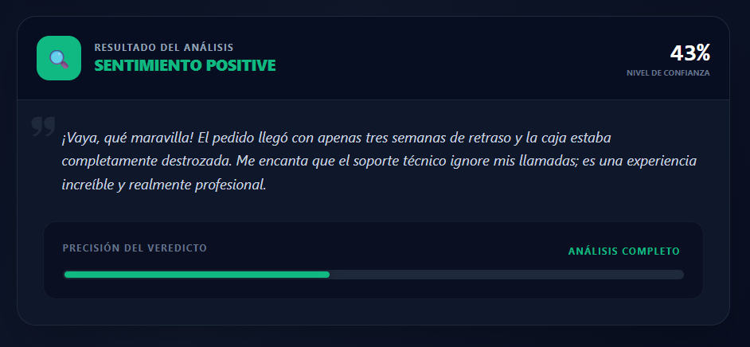

# 🎯 Análisis de Sentimientos - Frontend

El frontend permite a los usuarios interactuar con un modelo de Data Science (Regresión Logística + TF-IDF) de forma sencilla.



*Figura 1: Interfaz principal para ingreso de comentarios*


*Figura 2: Pantalla de resultados con sentimiento y probabilidad*

* **Sector:** Atención al Cliente / Operaciones.
* **Misión:** Transformar texto no estructurado en información accionable (Sentimiento + Probabilidad).
* **Validación:** Identificación de urgencias en quejas y medición de satisfacción.

## 🛠️ Stack Tecnológico

* **Framework:** Angular 17.3.6 (Standalone Components).
* **Estilos:** Tailwind CSS (Diseño responsivo y Dark Mode).
* **Comunicación:** REST API con backend en FastAPI.

## 📦 Arquitectura de Integración

La aplicación consume un microservicio de Inteligencia Artificial que sigue el siguiente flujo de datos:

1. **Input:** El usuario ingresa un texto (mínimo 3 caracteres).
2. **Procesamiento:** El servicio Angular envía un `POST` al backend de Python.
3. **Respuesta:** Se recibe un JSON con la `prevision` y la `probabilidad`.
4. **Visualización:** Interfaz dinámica que cambia de color según el sentimiento detectado.

## 📋 Requisitos Previos

* Node.js (versión 18 o superior).
* Angular CLI instalado globalmente.

## 🔧 Instalación y Uso

### 1. Clonar el repositorio:
```bash
git clone https://github.com/grupo-10-proyecto-1/demo
cd frontend-sentiment
```

### 2. Instalar dependencias:
```bash
npm install
```

### 3. Configurar el Backend:

Asegúrate de que tu API de FastAPI esté corriendo (por defecto en `http://localhost:8000`). Modifica el archivo `environment.ts` si es necesario.

### 4. Levantar servidor de desarrollo:
```bash
ng serve
```

Navega a `http://localhost:4200/`.

## 📂 Estructura de Componentes Clave

* **`AnalizarComentarioComponent`:** Maneja la entrada de texto y estados de carga.
* **`ResultadoComponent`:** Muestra el veredicto de la IA con barras de probabilidad dinámicas.
* **`FooterComponent`:** Contiene la documentación técnica y créditos del Hackathon (con diseño colapsable para móviles).

## 👥 Equipo - Grupo 10

Proyecto desarrollado por especialistas en Back-end (Java/Python) y Data Science para la comunidad de Alura Latam.

* **Backend/IA:** [Repositorio FastAPI](#)
* **Frontend:** [Repositorio Demo](https://github.com/grupo-10-proyecto-1/demo)

---

Este proyecto fue construido con fines educativos para demostrar la integración entre modelos de aprendizaje automático y aplicaciones web modernas.